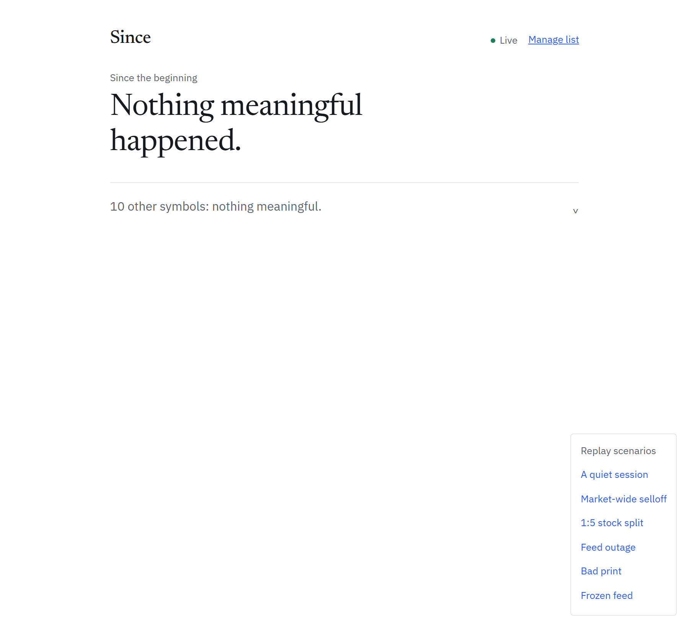

# Smart Market Watchlist

Most watchlists show you the market. Since shows what changed for you.

A per-user read watermark measures change against the price you last actually
saw — not yesterday's close. Every move is scored against that stock's own
volatility, so a 4% day counts for a large-cap bank and not for a smallcap
that swings 6% routinely. Moves the index already explains collapse into one
headline, surfacing only what moved differently — including the stock that
stayed flat while the market fell. Corporate actions are adjusted before any
return is computed, stale feeds never render as live, and silence is a
supported answer.

Stack: FastAPI (Python) + React (TypeScript) + Vite + SQLite  
Containerised stack: Postgres + Redis via Docker Compose

## Quick start

All paths below are from the repository root.

```bash
cd backend
python -m venv .venv && source .venv/bin/activate
pip install -r requirements.txt
python scripts/seed.py
python scripts/record_fixture.py
uvicorn app.main:app --reload
```

```bash
# In another terminal, from the repository root:
cd frontend
npm install
npm run dev
# Open http://localhost:5173
# Use demo@since.app as the login email
```

Full stack with Docker:

```bash
docker-compose up
# Open http://localhost:5173
```

Tests and the offline scenario runner:

```bash
cd backend
PYTHONPATH=. pytest -q        # 105 tests
PYTHONPATH=. python demo.py   # four scenarios, no market and no browser needed
```

No Postgres or Redis is required for a local run: the app defaults to SQLite
and an in-process cache, and the ingest worker runs as a daemon thread inside
the API process so one command starts everything. `docker-compose up` swaps in
the real services and runs the worker the way production would.

## The problem, restated

A watchlist gives you twelve numbers and no way to know which one matters. The
brief asks for "what has meaningfully changed since they last checked", which
decomposes into three questions that existing products answer badly or not at
all.

**"Since I last checked" requires memory of me.** Watchlists today are
stateless — every user sees identical output, so the best they can do is diff
against yesterday's close, which is a different question. `user_symbol_seen`
stores a per-user, per-symbol read watermark. The diff is computed against the
price *you* last saw. Keyed by user rather than device, advanced monotonically,
so reading on your phone settles it on your laptop and a stale tab open since
morning cannot resurrect what you already read.

**"Meaningfully" requires a definition of meaning.** A 4% move is a routine
session for a smallcap and a significant event for a large-cap bank. Every
signal is expressed in units of the symbol's own normal behaviour: the z-score
of today's return against its trailing 30-day distribution, confirmed by
relative volume adjusted for time of day. A 3σ move on 0.4× volume is a thin
order book. A 1.5σ move on 3× volume is people acting on something.

**"Deserves attention now" requires subtraction.** If the index falls 2% and
eleven of your twelve stocks fall about 2%, that is one piece of information,
not twelve. Scoring on the residual `r_stock − β × r_index` collapses those
rows into a single market headline and surfaces only what moved differently —
including the stock that stayed *flat* on a red day, which every conventional
watchlist renders as an unremarkable grey row.

## Architecture

Fan in on symbols, not users. The naive design fetches quotes per user request,
which is O(users × symbols) upstream calls and stops working at about fifty
users. Instead, poll the union of all watchlisted symbols once — a ref-counted
hot set, bounded by the ~2000 NSE tickers — compute change signals per symbol
once, and cache.

```
Shared, sized by instruments (bounded)      Personal, sized by users (unbounded)
  hot set → poller → validate                 watermarks ┐
              ↓                                          ├→ digest join → client
  nightly stats → detector → change_events ───────────────┘
```

Signal computation is shared; relevance is personal. User reads become a join
against precomputed events with zero upstream calls, which is the entire
scaling story.

## Data integrity

The three failure modes that matter in a product handling money, and what the
code does about each:

**Corporate actions.** A 1:5 split drops the quoted price 80% overnight. A
naive diff reports the largest signal the system has ever seen. One alert like
that and the user is right never to trust the product again. Bars are
back-adjusted before any return is computed — and every *stored level* is
restated too, not just `previous_close`. That second part was found by the
scenario runner, not by review: adjusting the close alone still produced a
false "new 52-week low", because the cached 52-week range was left in pre-split
share terms. A corporate action invalidates every cached price level at once.
Ratios (σ, β, mean return) are scale-invariant and must be left alone.

**Stale and frozen feeds.** Every quote carries `as_of`, `source` and a
freshness state, recomputed on read rather than frozen at fetch time — because
staleness is a property of the moment you look, not of the fetch. Degraded rows
are separated out before ranking, never mixed in as market news: their silence
is our failure, not the market's. A *frozen* feed is more dangerous than an
outage, since the payload looks healthy and only the timestamp reveals it.

**Bad prints and source conflict.** A 12σ jump between consecutive ticks is a
fat finger or a decimal shift, not a market event; it is quarantined, not
discarded, so a genuine limit-up move is delayed one cycle rather than lost.
When two sources disagree, the primary exchange price is served and the
disagreement is recorded. Deliberately **not** averaged: an average of two
numbers where one is wrong is a third wrong number that matches neither source
and destroys the evidence of which feed is broken.

## Attention budget, not thresholds

Threshold alerting ("tell me if it moves 5%") fails in both directions: it
floods on a crash day and goes silent for weeks through a calm month. The
digest is a fixed number of slots and the bar floats to fill them. Market
volatility varies enormously; a user's attention does not. So the constant in
the system is attention.

## Deliberately not built

- **No LLM ranking.** The obvious move, and a trap. When a judge asks why TCS
  ranked first, "the model decided" is not an engineering answer. Every row
  carries its own arithmetic — *"2.1σ move, 3.4× normal volume, +1.8% residual
  vs the index"* — deterministic, auditable, reproducible. In a product
  handling money, an alert you cannot explain is a liability.
- **No WebSockets.** SSE is unidirectional and this is a server-to-client push
  problem. WebSockets would add sticky sessions and a reconnect protocol to
  buy nothing.
- **No candlestick charts, no portfolio P&L, no news feed.** Each is a
  different product. Adding them would spend the time that went into making the
  diff correct.
- **No microservices.** Three workers and an API. Splitting them across
  services would add deployment complexity to a system that fits in one
  process.

## Layout

```
backend/app/
  detect/signals.py     pure math: z-score, RVOL, beta residual, gap
  detect/events.py      typed events, each carrying its own explanation
  detect/detector.py    tick + stats → events; runs once per symbol
  digest/service.py     watermark join, correlated collapse, attention budget
  digest/assembler.py   the storage-facing half; query count flat at 5
  digest/seen.py        the read watermark, monotonic in one upsert
  market/calendar.py    NSE sessions, holidays, intraday volume profile
  api/                  auth, watchlists, symbols, digest + SSE, demo controls
  statistics/compute.py nightly stats, split adjustment, beta
  market/validate.py    bad-tick quarantine, source reconciliation
  providers/base.py     provider interface, Quote with explicit freshness
  providers/replay.py   virtual clock + fault injection
  models.py             schema; shared tables vs personal tables

backend/workers/
  ingest.py             the poll loop; runs once per symbol, never per user
  nightly.py            statistics recompute, idempotent

backend/scripts/
  seed.py               deterministic offline data, beta-correlated returns
  record_fixture.py     writes data/session.jsonl for the replay provider

frontend/src/
  hooks/useSeenTracking.ts   IntersectionObserver dwell -> batched POST /seen
  hooks/useMarketStream.ts   SSE with backoff; refetch on reconnect
  components/DigestHeader.tsx  the verdict sentence, the hero of the page
```

## Demo (5 minutes)




Open http://localhost:5173, log in as demo@since.app.
Use the ScenarioPanel (bottom-right) to run each scenario in order.

1. Quiet day
   Click "Quiet day". The hero reads "Nothing meaningful happened."
   Point out: IRFC moved more than any other symbol in percentage terms.
   It is correctly silent because that is a routine day for a 6%-vol stock.

2. Market selloff
   Click "Market selloff". Two rows surface: TCS (split) and IRFC.
   Point out: four other stocks fell ~2% and are collapsed into the headline.
   The index explained their move. IRFC stayed flat when its beta of 1.38
   predicted a 3% fall - that is the only row carrying new information.

3. Split
   Click "Split". One row: "Split effective today (ratio 5).
   Price adjusted, holding unchanged."
   Point out: without adjustment this would read "-80%, most urgent event
   on the list." One false alert like that ends the product's credibility.

4. Feed failures (30 seconds total)
   Click "Feed outage" - INFY moves to degraded, separated from market rows.
   Click "Frozen feed" - HDFCBANK price goes muted with "as of HH:MM".
   Click "Bad tick" - RELIANCE quarantined, log shows sigma band rejection.
   Point out: a frozen feed is more dangerous than an outage because the
   payload looks healthy. Only the timestamp reveals it.

## What another week would add

- Per-symbol intraday volume profiles instead of the static NSE approximation.
  The current session_fraction is a fixed lookup table; a real version learns
  each symbol's own U-shape from historical intraday bars.
- Sector-relative residuals in addition to index-relative. A banking stock
  falling 2% when the Bank Nifty fell 2% is also explained away.
- Real auth - the dev-login is one FastAPI dependency; swapping it touches
  one function.
- Push notifications when a high-severity event fires while the app is
  backgrounded, using the Web Push API and the existing SSE event stream
  as the trigger.
- The yfinance provider against current Yahoo endpoints - the pin is stale
  and returns JSONDecodeError. The provider degrades correctly but live data
  requires a working endpoint or a paid alternative.

## Known issues

yfinance 0.2.44 returns JSONDecodeError against current Yahoo endpoints.
The provider degrades correctly (returns {}, logs, does not raise).
The replay provider is the demo path and is unaffected.
Bumping yfinance is deferred — live data is not required for the submission.

## Why the replay provider exists

It is not scaffolding. Free Indian market data endpoints are unreliable, NSE
trades 09:15–15:30 IST so any demo outside that window has no live data at all,
and — most importantly — the interesting behaviour of this system is what it
does when things go wrong. You cannot ask a live market to produce a split, a
frozen feed and a bad print on cue. `backend/demo.py` does exactly that, on demand, in
about ninety seconds.
